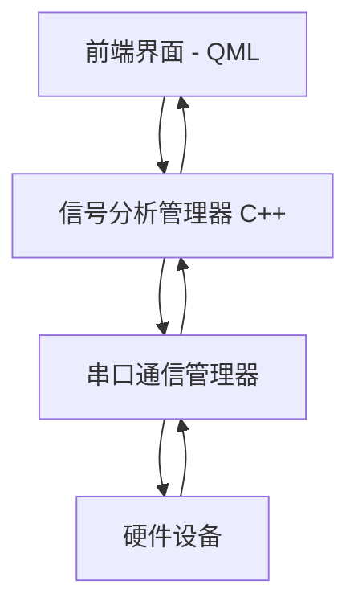
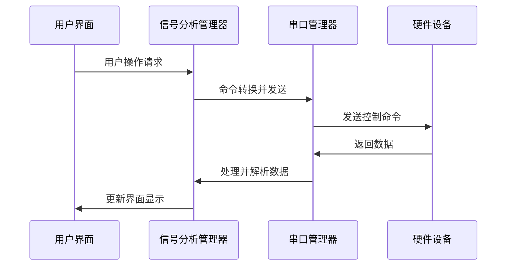
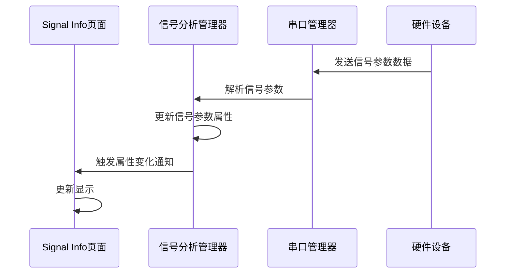
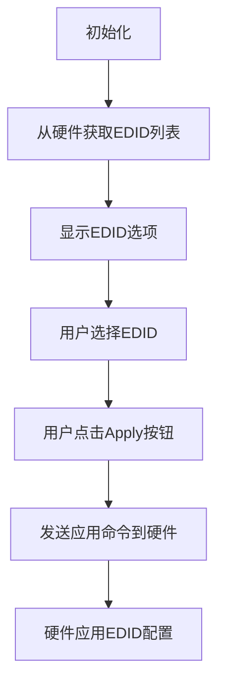
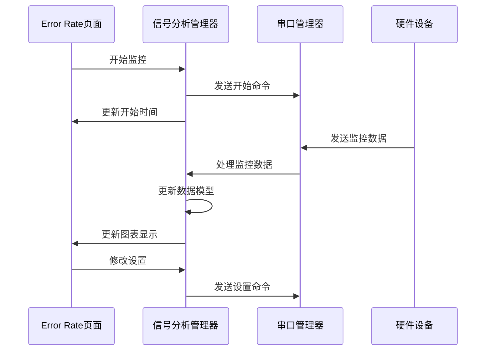

# SA01H-48G-V04 信号分析器功能分析文档

## 项目概述

SA01H-48G-V04 是一款基于 Qt/QML 开发的 HDMI 信号分析软件，用于测试、监控和分析 HDMI 视频信号。该应用与硬件设备（通过串口通信）集成，能够对 HDMI 信号的各种参数进行实时分析和监控。

### 主要功能模块

- **Monitor**: 显示输入视频信号并展示基本信号状态
- **Signal Info**: 显示详细的视频和音频信号参数
- **EDID**: EDID（扩展显示标识数据）配置和管理
- **Error Rate**: 信号错误率监控和分析

### 技术架构



项目采用了 Qt/QML 的前后端分离架构：
- 前端: 使用 QML 创建用户界面
- 后端: 使用 C++ 实现业务逻辑和数据处理
- 通信: 通过串口与硬件设备进行通信

## 数据流



## 详细页面分析

### 1. Monitor 页面

#### 功能描述

Monitor 页面主要用于实时显示输入的视频信号，并展示基本的信号状态信息。

#### 核心功能
- 显示实时视频信号或色带图案
- 显示信号状态（有信号/无信号）
- 显示基本信号参数（分辨率、信号类型等）
- 提供刷新功能

#### 数据流

```mermaid
flowchart TD
    A[用户点击 Refresh] --> B[发送刷新命令到硬件]
    B --> C{检查信号状态}
    C -->|有信号| D[显示视频图像]
    C -->|无信号| E[显示"No Signal"]
    D --> F[显示信号参数]
    F --> G[更新UI]
```

#### 实现细节

Monitor 页面通过 `SignalAnalyzer` 组件实现，主要功能集中在：
- `SignalAnalyzer.qml` 负责 UI 渲染和用户交互
- `signalanalyzermanager.cpp` 中的 `startFpgaVideo()` 方法负责与硬件通信获取视频帧
- `processReceiveData()` 方法处理接收到的数据并更新 UI

当页面加载或用户点击"刷新"按钮时，系统会发送命令（如 `REFRESH_FRAME`）到硬件设备，硬件返回视频帧数据和信号状态，然后更新界面显示。

### 2. Signal Info 页面

#### 功能描述

Signal Info 页面显示详细的视频和音频信号参数，为用户提供全面的信号信息分析。

#### 核心功能
- 显示视频信号参数：视频格式、色彩空间、色彩深度、HDR格式等
- 显示音频信号参数：采样频率、采样大小、声道数量等
- 自动更新参数显示

#### 数据流



#### 实现细节

Signal Info 页面通过两个主要部分实现：
1. **视频信息区域**：显示 `videoFormat`、`colorSpace`、`colorDepth`、`hdrFormat`、`hdmiDvi`、`frlRate`、`dscMode` 和 `hdcpType` 等参数
2. **音频信息区域**：显示 `samplingFreq`、`samplingSize`、`channelCount`、`channelNumber`、`levelShift`、`cBitSamplingFreq` 和 `cBitDataType` 等参数

数据处理流程：
- 硬件设备通过串口发送包含信号参数的数据
- `SerialPortManager` 接收数据并通过 `dataReceived` 信号传递给 `SignalAnalyzerManager`
- `SignalAnalyzerManager` 根据信号代码（如 `61 80`、`63 80` 等）解析相应参数
- 解析后的参数通过 Qt 的属性系统（Property System）自动更新到 QML 界面

### 3. EDID 页面

#### 功能描述

EDID 页面用于管理和配置 EDID（扩展显示标识数据）设置，允许用户选择和应用不同的 EDID 配置文件。

#### 核心功能
- 显示可用的 EDID 配置项列表
- 允许用户选择单个 EDID 配置
- 提供应用按钮将选定的 EDID 配置应用到硬件

#### 数据流



#### 实现细节

EDID 页面主要通过以下组件实现：
- 在 QML 中使用 `Repeater` 组件基于 `edidList` 属性生成 EDID 选项列表
- `selectSingleEdid()` 方法实现单选功能，确保只有一个 EDID 被选中
- `applyEdid()` 方法将选中的 EDID 应用到硬件设备

硬件通信采用类似 `SET INx EDIDy` 的命令格式，其中 x 表示输入端口，y 表示 EDID 索引。

当用户点击 "Apply" 按钮时，系统会生成相应的命令（如 `SET IN1 EDID3`）并通过串口发送到硬件设备。

### 4. Error Rate 页面

#### 功能描述

Error Rate 页面用于监控信号错误率，记录和分析信号异常事件，帮助用户诊断信号质量问题。

#### 核心功能
- 开始/停止错误率监控
- 设置时间槽间隔（秒或分钟）
- 设置触发模式（图像差异+信号丢失或仅信号丢失）
- 显示错误率数据图表
- 支持数据导出

#### 数据流



#### 实现细节

Error Rate 页面的实现涉及多个关键组件：

1. **监控控制区域**：
   - "New Start" 按钮：调用 `startMonitor()` 方法开始新的监控会话
   - 显示监控开始时间

2. **时间槽设置区域**：
   - 自定义 SpinBox 用于设置时间槽间隔（1-100）
   - 单选按钮选择时间单位（秒/分钟）

3. **触发模式设置**：
   - 选择触发事件的检测模式（图像差异+信号丢失或仅信号丢失）

4. **数据处理流程**：
   - `processMonitorCommand()` 方法处理来自硬件的监控数据
   - `updateSlotData()` 方法更新特定时间槽的信号状态
   - `updateMonitorDataFromTimeSlots()` 方法将数据转换为 QML 可用的格式
   - `detectTriggerEvent()` 方法根据设定的触发模式检测信号事件
   - `isSignalLost()` 方法检测信号是否丢失

5. **数据导出**：
   - `exportMonitorData()` 方法支持将监控数据导出到文件

## 通信协议

系统与硬件设备的通信采用串口通信，主要使用以下几种命令格式：

1. **EDID 相关命令**：
   - `SET INx EDIDy`: 设置输入端口 x 使用 EDID y
   - `GET INx EDIDy DATA`: 获取 EDID 数据

2. **监控相关命令**：
   - `START MONITOR`: 开始监控
   - `SET MONITOR SLOT <secs>`: 设置时间槽间隔
   - `SET MONITOR UNIT S/M`: 设置时间单位（秒/分）
   - `SET MONITOR MODE DIFF/LOSS`: 设置触发模式

3. **视频相关命令**：
   - `REFRESH_FRAME`: 刷新视频帧

## 总结

SA01H-48G-V04 信号分析器是一款功能全面的 HDMI 信号分析工具，提供了直观的用户界面和强大的分析功能。通过 Monitor、Signal Info、EDID 和 Error Rate 四个主要功能模块，用户可以全面监控和分析 HDMI 信号的各项参数，有效诊断和解决信号问题。

系统采用 Qt/QML 框架开发，前后端分离的架构使界面开发和业务逻辑开发可以并行进行。通过串口与硬件设备通信，实现了软硬件的无缝集成。 