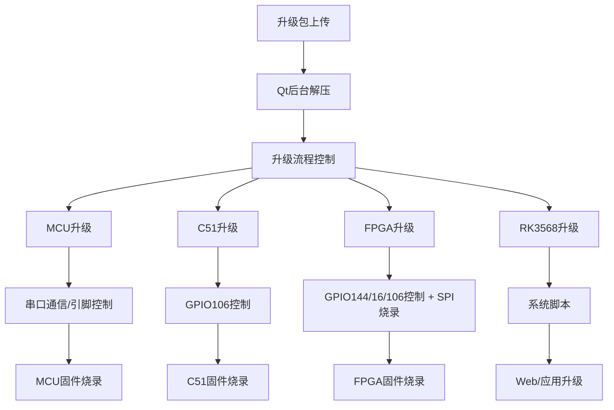
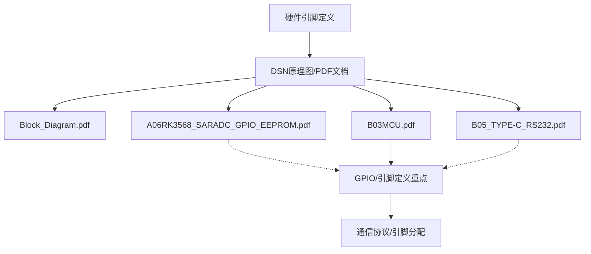

# 板卡升级功能与硬件引脚/协议分析

## 1. DSN原理图/PDF文档与引脚定义

### 1.1 DSN文档用途
- DSN文件（通常为原理图设计文件）可用于确认**硬件引脚分配**、**通信接口**、**GPIO编号**等底层硬件信息。
- 你导出的PDF列表中，以下文档最有可能包含**引脚定义/通信协议**相关内容：

| 文件名 | 可能内容 |
|--------|----------|
| **A06RK3568_SARADC(GPIO)EEPROM.pdf** | GPIO分配、引脚定义、部分通信接口 |
| **B03MCU.pdf** | MCU相关引脚、MCU与主控/外设的通信接口 |
| **B05_TYPE-C&RS232.pdf** | 串口通信（RS232）、Type-C接口定义 |
| **Block_Diagram.pdf** | 总体架构、各芯片/模块连接关系 |

> 其中，`A06RK3568_SARADC(GPIO)EEPROM.pdf`、`B03MCU.pdf`、`B05_TYPE-C&RS232.pdf` 是查找**引脚编号、GPIO分配、串口通信**的首选。

---

## 2. SG升级功能涉及的引脚与通信协议

### 2.1 升级流程涉及的硬件/协议
- **MCU升级**：通过串口（如ttyS5）与MCU通信，需MCU固件支持特定升级协议（如Bootloader/ISP模式）。
- **C51升级**：通过GPIO控制C51进入升级模式（如GPIO106），再通过串口通信烧录固件。
- **FPGA升级**：通过GPIO控制FPGA进入升级模式（如GPIO144、GPIO16、GPIO106），再用SPI工具烧录FPGA固件。
- **SPI烧录**：/userdata/spi工具通过SPI总线与FPGA通信，烧录top.bin。

#### 相关协议/引脚：
- **串口通信**：RS232/TTL物理层，协议为自定义升级命令（如"UPGRADE||Main,0,0"）。
- **GPIO控制**：Linux sysfs接口，echo导出/设置方向/电平，控制MCU/C51/FPGA进入升级模式。
- **SPI通信**：通过spi工具命令行参数指定固件文件和起始地址。

### 2.2 升级功能代码与协议关系
- SG升级功能（见`升级功能.md`）核心流程：
  1. Web前端上传update.zip，Qt后台解压
  2. 选择升级组件，前端发起升级命令
  3. Qt后台根据组件类型，执行对应的GPIO/串口/SPI操作
  4. 进度与日志通过WebSocket实时反馈

#### 关键代码片段：
- **MCU升级**：
  - 通过串口（如ttyS5）发送升级命令，MCU需支持接收并响应（Bootloader协议）
- **C51升级**：
  - GPIO106导出并拉低/拉高，控制C51进入ISP模式
  - 通过串口发送ISP命令，烧录c51.hex
- **FPGA升级**：
  - GPIO144、GPIO16、GPIO106等控制FPGA进入升级模式
  - SPI工具烧录top.bin

---

## 3. 实际问题分析与硬件兼容性

### 3.1 现象回顾
- 你用SG的固件和应用在SA板子上测试升级，发现：
  - MCU升级卡住，日志提示"Read the bootcode information of 'Main' fail, retry..."
  - C51升级也失败，FPGA升级表面成功但后台无FPGA返回日志
  - 宏炫反馈"虽然两块板子外观一样，但引脚可能有区别"

### 3.2 原因分析
- **MCU升级失败**：
  - 可能原因：SA板子的MCU固件版本不支持SG的升级协议（Bootloader通信协议不兼容）
  - 需要君泽提供支持新升级协议的MCU固件
- **C51升级失败**：
  - 可能原因：GPIO编号/引脚分配在两块板子上不同，导致C51无法进入升级模式
  - 也可能是C51固件本身不支持SG的升级流程
- **FPGA升级无返回**：
  - 可能原因：SPI烧录工具与FPGA的连接引脚在两块板子上不同，或GPIO控制逻辑不兼容
  - 也可能是升级后FPGA未能正常启动，或日志反馈机制不同

### 3.3 结论
- **硬件兼容性是关键**：即使两块板子外观一样，MCU、C51、FPGA的引脚分配、GPIO编号、串口号等底层硬件细节可能不同，导致升级流程不兼容。
- **DSN/PDF原理图是唯一权威依据**：只有查阅原理图，才能确认每个引脚的真实分配和功能。
- **MCU/C51固件需配套**：升级协议和引脚控制必须与硬件和固件版本严格匹配。

---

## 4. 推荐操作与查阅方法

1. **查阅DSN/PDF原理图**：
   - 重点看`A06RK3568_SARADC(GPIO)EEPROM.pdf`、`B03MCU.pdf`、`B05_TYPE-C&RS232.pdf`，确认GPIO编号、串口号、通信接口分配。
   - `Block_Diagram.pdf`可辅助理解整体架构。
2. **与硬件/固件负责人沟通**：
   - 明确MCU、C51、FPGA的固件版本和升级协议是否与SG板子完全一致。
   - 如有差异，需定制/适配固件和升级流程。
3. **升级流程调试建议**：
   - 先用原配套固件和应用验证升级流程
   - 如需移植，逐步比对每一步的GPIO/串口/SPI操作与原理图/固件文档

---

## 5. 升级流程与引脚/协议关系图

---

## 6. DSN/PDF文档结构参考图

---

## 7. 总结
- **SG升级功能涉及大量底层引脚和通信协议控制**，必须与硬件原理图和固件严格匹配。
- **DSN/PDF原理图是查找引脚分配和通信协议的唯一权威资料**，建议重点查阅上述推荐文档。
- **硬件兼容性问题是升级失败的主要原因**，需与硬件/固件负责人密切配合，逐步排查。 