# sa01h-48g-v04-web 升级功能详细分析

## 1. 系统架构概览

升级系统采用了Web前端 + Qt后台的架构：

- **Web前端**: `ph1-sw41hh-u22-web` 项目中的 `systemsetting.vue`
- **Qt后台**: `sa01h-48g-v04-web` 项目作为后台服务程序
- **通信协议**: WebSocket (端口8081)

```
Web前端 (Vue.js)  ←→  WebSocket  ←→  Qt后台程序 (QML/C++)
    ↓                                      ↓
systemsetting.vue                 sa01h-48g-v04-web
```

## 2. 升级包结构

升级包为 `update.zip`，解压后包含以下子包：

```
update/
├── C51.zip     # C51单片机固件
├── fpga.zip    # FPGA固件 
├── mcu.zip     # 主控MCU固件
├── sg.zip      # 系统软件包
├── spi.zip     # SPI烧录工具
└── www.zip     # Web应用包
```

## 3. WebSocket通信机制详解

### 3.1 服务器端实现 (Qt后台)

Qt后台程序启动WebSocket服务器(main.qml)：

```qml
WebSocketServer {
    id: webSocketServer
    port: 8081
    Component.onCompleted: {
        webSocketServer.startServer();
    }
}
```

**WebSocket连接建立和区分机制**：

当客户端连接到WebSocket服务器时，后台通过URL路径来区分连接类型：

```cpp
// websocketserver.cpp - onNewConnection函数
void WebSocketServer::onNewConnection()
{
    QWebSocket *pSocket = m_pWebSocketServer->nextPendingConnection();
    QString path = pSocket->requestUrl().path();  // 获取请求路径
    qDebug() << "New client connected to path:" << path;

    // 根据路径分配到不同的客户端列表
    if (path == "/ws/upload") {
        m_uploadClients << pSocket;  // 升级专用连接列表
    } else if (path == "/ws/uart") {
        m_clients << pSocket;        // 串口通信连接列表
    } else {
        qDebug() << "Unknown path, closing connection:" << path;
        pSocket->close();  // 未知路径，关闭连接
        return;
    }
    
    // 绑定消息处理函数
    connect(pSocket, &QWebSocket::textMessageReceived, this, &WebSocketServer::processTextMessage);
    connect(pSocket, &QWebSocket::binaryMessageReceived, this, &WebSocketServer::processBinaryMessage);
}
```

支持两种路径的WebSocket连接：
- `/ws/upload`: 用于升级文件上传和升级控制
- `/ws/uart`: 用于串口通信和状态查询

**消息路由机制**：
```cpp
// 在消息处理时根据发送者确定路径
QString path = m_uploadClients.contains(pSender) ? "/ws/upload" : "/ws/uart";
```

### 3.2 客户端实现 (Web前端)

Web前端通过WebSocket连接到Qt后台：

```javascript
// systemsetting.vue - ws_upload_open函数
ws_upload_open() {
    let self = this;
    // 连接到升级专用路径
    this.socket = new WebSocket("ws://" + location.hostname + ":8081/ws/upload");
    
    this.socket.onmessage = function (event) {
        console.log("UPLOAD: " + event.data);
        self.data_split(event.data);  // 处理接收到的消息
    };
    
    this.socket.onopen = function (event) {
        console.log("uploadpath successfully connected");
    };
    
    // 自动重连机制
    this.socket.onclose = function (event) {
        console.log("uploadpath connection closed");
        setTimeout(() => {
            self.ws_upload_open();  // 1秒后重连
        }, 1000);
    };
}
```

## 4. 文件上传详细流程

### 4.1 文件接收和保存过程

**步骤1: 用户选择文件**
```javascript
// 用户在Web界面选择update.zip文件，触发uploadFiles函数
uploadFiles() {
    if (!this.checkFile()) {  // 验证文件格式
        this.DialogOTANotice = true;
        this.OTANoticeText = "Please select the correct firmware file!";
        return;
    }
    let name = this.files[0].name;
    if (name.endsWith(".zip")){
        this.uploadingFile = true;
        this.uploadingFileType = "ZIP";
        this.uploadFile(3);  // 调用上传函数，参数3表示ZIP类型
    }
}
```

**步骤2: 分片上传**
```javascript
// uploadFile函数 - 文件分片上传
uploadFile(upgradetype) {
    this.uploadingFile = true;
    var blob = this.files[0];  // 获取文件对象
    
    // 发送开始上传命令 (cmd = 30 for ZIP)
    this.socket.send(JSON.stringify({
        cmd: upgradetype * 10,      // 3 * 10 = 30
        data: blob.name,            // 文件名
    }));
    
    const BYTES_PER_CHUNK = 1024 * 1024 * 2;  // 2MB分片大小
    const SIZE = blob.size;                    // 文件总大小
    
    var start = 0;
    var end = BYTES_PER_CHUNK;
    
    // 循环发送文件数据块
    while (start < SIZE) {
        var chunk = blob.slice(start, end);    // 切片
        this.socket.send(chunk);               // 发送二进制数据
        start = end;
        end = start + BYTES_PER_CHUNK;
    }
    
    // 发送结束命令 (cmd = 31 for ZIP)
    this.socket.send(JSON.stringify({
        cmd: upgradetype * 10 + 1,  // 3 * 10 + 1 = 31
        data: blob.name,
    }));
}
```

**步骤3: Qt后台文件接收**
```cpp
// websocketserver.cpp - processTextMessage函数处理控制命令
void WebSocketServer::processTextMessage(const QString &message) {
    QWebSocket *pSender = qobject_cast<QWebSocket *>(sender());
    QString path = m_uploadClients.contains(pSender) ? "/ws/upload" : "/ws/uart";
    if(path=="/ws/upload"){
        QJsonDocument doc = QJsonDocument::fromJson(message.toUtf8());
       if (doc.isNull()) {
           qDebug() << "Invalid JSON message";
           emit messageReceived(message,path);
           return;
       }

       QJsonObject json = doc.object();
       int cmd = json["cmd"].toInt();
       QString filename = json["data"].toString();


       if (cmd % 10 == 0) {
           m_terminalManager.executeCommand("mkdir /tmp/update");
           m_terminalManager.executeCommand("rm -rf /tmp/update/*");
           QString filePath = "/tmp/update/update.zip";
           QFile *file = new QFile(filePath);
           if (!file->open(QIODevice::WriteOnly)) {
               qDebug() << "Failed to open file for writing:" << filePath;
               delete file;
               return;
           }
           m_activeFileUploads[pSender] = file;
           qDebug() << "Start receiving file:" << filePath;

       } else if (cmd % 10 == 1) {
           if (m_activeFileUploads.contains(pSender)) {

               m_terminalManager.executeDetachedCommand("/data/upgrademodule");
               QFile *file = m_activeFileUploads.take(pSender);
//               file->close();
               QFileInfo fileInfo(*file);
               qint64 fileSize = fileInfo.size();
               qDebug() << "File upload completed:" << filename << "Size:" << fileSize << "bytes";
               delete file;
               m_terminalManager.executeCommand("unzip -o /tmp/update/update.zip -d /tmp/update");
               m_terminalManager.executeCommand("rm -rf /userdata/spi");
               m_terminalManager.executeCommand("mv /tmp/update/spi /userdata/spi");
               m_terminalManager.executeCommand("chmod +x /userdata/spi");

               QDir updateDir("/tmp/update");
               if (!updateDir.exists()) {
                   qDebug() << "Directory /tmp/update does not exist";
                   return;
               }
               QString filenum = "";
               QFileInfoList entries = updateDir.entryInfoList(QDir::NoDotAndDotDot | QDir::AllEntries);
               for (const QFileInfo &entry : entries) {
                   qDebug() << (entry.isDir() ? "[DIR] " : "[FILE]") << entry.fileName()
                            << "Size:" << entry.size() << "bytes";
                   filenum += entry.fileName()+" ";
               }
               sendMessageToUploadClients("File upload completed\r\n");
               sendMessageToUploadClients("upgradenum:"+filenum.trimmed()+"\r\n");

               if(cmd==31){
                   qDebug() << "start unzip:" << filename;
//                   connectToTcpServer("127.0.0.1", 35353);
//                    m_terminalManager.executeDetachedCommand("/userdata/update.sh");
               }
           }
       }
    }else {
        emit messageReceived(message,path);
    }

}

// processBinaryMessage函数处理二进制数据
void WebSocketServer::processBinaryMessage(const QByteArray &message) {
    QWebSocket *pSender = qobject_cast<QWebSocket *>(sender());
    
    if (m_activeFileUploads.contains(pSender)) {
        QFile *file = m_activeFileUploads[pSender];
        qDebug() << "Writing to file:" << file->fileName() 
                 << "Size:" << message.size() << "bytes";
        file->write(message);    // 写入文件数据
        file->flush();           // 强制刷新到磁盘
    }
}
```
```
root@rk3568-buildroot:/data# strings upgrademodule | head -n 20
/lib/ld-linux-aarch64.so.1
libQt5Network.so.5
_init
__gmon_start__
_fini
_ITM_deregisterTMCloneTable
_ITM_registerTMCloneTable
_ZN12QHostAddressD1Ev
_ZN10QTcpServerC1EP7QObject
_ZN10QTcpSocketC1EP7QObject
_ZN10QTcpServer6listenERK12QHostAddresst
_ZNK15QAbstractSocket5stateEv
_ZN15QAbstractSocket5abortEv
_ZNK12QHostAddress8toStringEv
_ZNK15QAbstractSocket11peerAddressEv
_ZN10QTcpServer5closeEv
_ZN12QHostAddressC1ENS_14SpecialAddressE
_ZNK15QAbstractSocket8peerPortEv
_ZNK10QTcpServer11errorStringEv
libQt5SerialPort.so.5
root@rk3568-buildroot:/data# 
```

### 4.2 自动解压缩处理

**解压缩位置**: 当文件上传完成后，在Qt后台的`processTextMessage`函数中自动执行：

```cpp
// cmd % 10 == 1 时执行 (结束上传命令)
if (m_activeFileUploads.contains(pSender)) {
    QFile *file = m_activeFileUploads.take(pSender);
    QFileInfo fileInfo(*file);
    qint64 fileSize = fileInfo.size();
    qDebug() << "File upload completed:" << filename << "Size:" << fileSize << "bytes";
    delete file;
    
    // 自动解压缩升级包
    m_terminalManager.executeCommand("unzip -o /tmp/update/update.zip -d /tmp/update");
    
    // 处理SPI工具
    m_terminalManager.executeCommand("rm -rf /userdata/spi");
    m_terminalManager.executeCommand("mv /tmp/update/spi /userdata/spi");
    m_terminalManager.executeCommand("chmod +x /userdata/spi");
    
    // 扫描解压后的文件列表
    QDir updateDir("/tmp/update");
    QString filenum = "";
    QFileInfoList entries = updateDir.entryInfoList(QDir::NoDotAndDotDot | QDir::AllEntries);
    for (const QFileInfo &entry : entries) {
        qDebug() << (entry.isDir() ? "[DIR] " : "[FILE]") << entry.fileName();
        filenum += entry.fileName() + " ";
    }
    
    // 通知前端文件列表
    sendMessageToUploadClients("File upload completed\r\n");
    sendMessageToUploadClients("upgradenum:" + filenum.trimmed() + "\r\n");
}
```

## 5. 升级执行流程

### 5.1 升级流程图

以下是从页面操作到升级完成的完整流程：

```mermaid
graph TD
    A[用户点击选择文件] --> B[选择update.zip文件]
    B --> C[点击Upload按钮]
    C --> D[checkFile验证文件格式]
    D --> E{文件格式是否正确}
    E -->|否| F[显示错误提示]
    E -->|是| G[uploadFiles函数]
    G --> H[调用uploadFile函数]
    H --> I[发送开始命令JSON]
    I --> J[文件分片2MB]
    J --> K[循环发送二进制数据块]
    K --> L[发送结束命令JSON]
    L --> M[Qt后台接收数据]
    M --> N[创建/tmp/update目录]
    N --> O[保存为update.zip]
    O --> P[自动解压到/tmp/update]
    P --> Q[移动spi工具到/userdata]
    Q --> R[发送upgradenum消息]
    R --> S[显示可升级组件列表]
    S --> T[用户点击Upgrade]
    T --> U[upgrade函数发送升级命令]
    U --> V[Qt后台接收升级指令]
    V --> W{升级组件类型}
    W -->|MCU| X[upgrademcu函数]
    W -->|C51| Y[upgradec51函数]
    W -->|FPGA| Z[upgradefpga函数]
    W -->|RK3568| AA[upgraderk3568函数]
    X --> BB[解压mcu.zip到/data]
    X --> CC[连接TCP服务器35353端口]
    Y --> DD[GPIO106控制]
    Y --> EE[解压c51.zip到/data]
    Y --> FF[串口发送ISP命令]
    Z --> GG[GPIO144控制]
    Z --> HH[解压fpga.zip到/data]
    Z --> II[SPI烧录FPGA]
    AA --> JJ[执行update.sh脚本]
    BB --> KK[升级完成]
    FF --> LL[升级完成]
    II --> MM[升级完成]
    JJ --> NN[升级完成]
```



### 5.2 升级执行阶段

升级按以下顺序执行：`mcu → c51 → fpga → rk3568`

```javascript
// Web前端 - upgrade函数
upgrade() {
    this.log_show_flag = true;     // 显示日志窗口
    this.processs_flag = true;     // 显示进度条
    this.upbtn_enable_flag = false; // 禁用上传按钮
    
    var str = "upgrade:";
    if(this.upgrade_mcu) str += "mcu,";
    if(this.upgrade_c51) str += "c51,";
    if(this.upgrade_fpga) str += "fpga,";
    if(this.upgrade_rk3568) str += "rk3568";
    
    this.socket.send(str + "\r\n");  // 发送升级命令到Qt后台
}
```

## 6. 关键函数功能详解

### 6.1 webSocketServer.sendMessageToAllClients功能

```qml
// main.qml中的功能说明
// 向所有连接到/ws/uart路径的客户端发送消息
function sendMessageToAllClients(message) {
    // 遍历所有串口通信客户端
    for (QWebSocket *pClient : qAsConst(m_clients)) {
        if (pClient && pClient->isValid()) {
            pClient->sendTextMessage(message);  // 发送文本消息
        }
    }
}

// 用途：
// 1. 发送升级日志: "UPGRADELOG||start upgrade mcu...\r\n"
// 2. 发送进度信息: "PROGRESSVALUE||50\r\n" 
// 3. 发送状态响应: "RESPONSE||F858||1,V1.0\r\n"
```

### 6.2 webSocketServer.sendMessageToUploadClients功能

```cpp
// websocketserver.cpp
void WebSocketServer::sendMessageToUploadClients(const QString &message) {
    // 向所有连接到/ws/upload路径的客户端发送消息
    for (QWebSocket *client : qAsConst(m_uploadClients)) {
        if (client && client->isValid()) {
            client->sendTextMessage(message);
        }
    }
}

// 用途：
// 1. 文件上传完成通知: "File upload completed\r\n"
// 2. 升级包内容列表: "upgradenum:mcu.zip c51.zip fpga.zip\r\n"
// 3. IP配置响应: "host ip 192.168.1.100\r\n"
```

### 6.3 terminalManager.executeCommand功能

```qml
// TerminalManager是Qt后台的终端命令执行组件
// 功能：同步执行Linux系统命令并等待结果

terminalManager.executeCommand("mkdir /tmp/update");
// 作用：创建临时目录用于存放升级文件

terminalManager.executeCommand("rm -rf /tmp/update/*");
// 作用：清空临时目录中的所有文件

terminalManager.executeCommand("unzip -o /tmp/update/update.zip -d /tmp/update");
// 作用：解压升级包到指定目录
// -o: 覆盖已存在文件
// -d: 指定解压目标目录
```

### 6.4 webSocketServer.connectToTcpServer功能

```cpp
// websocketserver.cpp
void WebSocketServer::connectToTcpServer(const QString &host, quint16 port) {
    m_tcpClient->connectToServer(host, port);
}

// 为什么要连接TCP服务器(端口35353)？
// 1. MCU升级需要通过专门的固件升级服务
// 2. 该服务运行在localhost:35353端口
// 3. Qt后台作为中介，将升级命令转发给固件升级服务
// 4. 固件升级服务负责具体的MCU固件烧录过程
```

## 7. Linux命令详解

### 7.1 GPIO控制命令

```bash
# C51升级GPIO控制命令详解
"echo 106 > /sys/class/gpio/export"
# 作用：导出GPIO106引脚，使其可以被用户空间程序控制(告诉 Linux：“我要使用 GPIO106”,这会在 /sys/class/gpio/gpio106/ 下生成控制文件夹，用户空间就能操作这个 GPIO 引脚)
# GPIO106对应AF2引脚，用于控制C51升级模式
# 背景：Linux 内核默认把 GPIO 设备都屏蔽掉，只有你“导出”后才可控

"echo out > /sys/class/gpio/gpio106/direction"  
# 作用：设置GPIO106为输出模式
# direction文件控制引脚的输入/输出方向
# 背景： 如果你想用它“控制”别的芯片（比如 C51），就要输出电平（不是读取），所以这步是必要的初始化

"echo 0 > /sys/class/gpio/gpio106/value"
# 作用：设置GPIO106输出低电平(0V)，让 C51 引脚进入“低电平等待状态”
# 将C51置于准备升级状态

"echo 1 > /sys/class/gpio/gpio106/value"
# 作用：设置GPIO106输出高电平(3.3V) ，相当于制造了一个“上升沿”信号
# 触发C51进入升级模式（上升沿触发）
# 很多单片机（比如 STC 系列）通过某个 GPIO 引脚的“上升沿”判断是否进入 ISP/升级模式
# 所以你必须先 0 → 然后再 1，模拟这个跳变


# 为什么要用 echo 写文件？	Linux 的 sysfs 是“用文件模拟硬件接口”，写文件就是写寄存器
# 为什么 GPIO 要先 export？	Linux 出于安全与效率考虑，不默认暴露所有 GPIO
# 为什么先 0 后 1？	因为 C51 是通过上升沿识别“升级模式”的触发条件
# 如果重复操作呢？	多次 export 会报错，可先 unexport；重复拉低再拉高是无害的
```

### 7.2 文件操作命令

```bash
"rm -rf /data/c51.hex"
# 作用：删除旧的C51固件文件
# -r: 递归删除
# -f: 强制删除，不询问

"unzip -o /tmp/update/c51.zip -d /data/"
# 作用：解压C51固件包到/data目录
# -o: 覆盖已存在的文件
# -d: 指定解压目标目录
```

### 7.3 串口通信命令

```javascript
serialPortManager.writeDataUart6("ISP 51 2\r\n", 1);
// 作用：向串口6发送ISP命令
// "ISP 51 2": 启动C51 ISP(In-System Programming)模式
// ISP: 在系统编程，允许通过串口更新固件
// 参数2: 可能表示升级模式类型或波特率设置
// \r\n: 回车换行符，命令结束标志
```

## 8. FPGA升级详细说明

### 8.1 upgradefpga函数详解

```qml
// main.qml - upgradefpga函数
function upgradefpga(){
    // GPIO控制 - 进入FPGA升级模式
    
    // 1. 控制U3引脚(GPIO144)
    terminalManager.executeCommand("echo 144 > /sys/class/gpio/export");
    // 导出GPIO144，对应硬件引脚U3
    
    terminalManager.executeCommand("echo out > /sys/class/gpio/gpio144/direction");
    // 设置为输出模式
    
    terminalManager.executeCommand("echo 1 > /sys/class/gpio/gpio144/value");
    // 设置高电平 - 注意：这与文档要求不符！
    // 文档要求U3应该设为LOW，但代码设为HIGH
    
    // 2. 控制GPIO42 (可能是其他控制引脚)
    terminalManager.executeCommand("echo 42 > /sys/class/gpio/export");
    terminalManager.executeCommand("echo out > /sys/class/gpio/gpio42/direction");
    // 只是导出和设置方向，没有设置电平值
    
    // 3. 固件文件处理
    terminalManager.executeCommand("rm -rf /data/top.bin");
    // 删除旧的FPGA固件文件
    
    terminalManager.executeCommand("unzip -o /tmp/update/fpga.zip -d /data/");
    // 解压FPGA固件包，获取top.bin文件
    
    webSocketServer.sendMessageToAllClients("UPGRADELOG||start upgrade FPGA...\r\n");
    // 通知前端开始FPGA升级
    
    // 4. SPI烧录FPGA
    terminalManager.executeCommand("/userdata/spi -w -f /data/top.bin -a 0000");
    // 使用SPI工具烧录FPGA固件
    // -w: 写入模式
    // -f: 指定固件文件路径
    // -a 0000: 起始地址为0x0000
}
```

### 8.2 GPIO引脚对应关系来源

**GPIO编号和引脚的对应关系**来源于`GPIO_FPGA_Control_README.md`文档：

```markdown
| 物理引脚 | GPIO定义    | 理论计算值 | 实际使用GPIO | 测试状态 |
|---------|-------------|------------|-------------|---------|
| A21     | GPIO0_C4_d  | 20         | **16**      | ✅ 通过  |
| U3      | GPIO4_C0_d  | 144        | **144**     | ✅ 通过  |
| AF2     | GPIO3_B2_d  | 106        | **106**     | ✅ 通过  |

GPIO编号计算方法：
- GPIO组基数：GPIOx = x × 32
- 子组偏移：A=0, B=8, C=16, D=24  
- 最终编号：组基数 + 子组偏移 + 引脚号

例如GPIO4_C0_d：
4 × 32 + 16 + 0 = 144
```

**实际vs文档对比**：
| 引脚 | 文档要求 | 代码实现 | GPIO编号 | 说明 |
|------|----------|----------|----------|------|
| A21  | HIGH     | ❌未实现  | GPIO16   | 需要拉高使能FPGA升级 |
| U3   | LOW      | ❌设为HIGH | GPIO144  | 应该拉低进入升级模式 |
| AF2  | LOW      | ❌未实现  | GPIO106  | 需要拉低配合升级 |

## 9. RK3568系统升级

### 9.1 系统升级脚本

```qml
function upgraderk3568(){
    webSocketServer.sendMessageToAllClients("UPGRADELOG||start upgrade web...\r\n");
    
    // 模拟进度显示  这个升级进度是模拟的？
    webSocketServer.sendMessageToAllClients("PROGRESSVALUE||10.00\r\n");
    webSocketServer.sendMessageToAllClients("PROGRESSVALUE||40.00\r\n");
    webSocketServer.sendMessageToAllClients("PROGRESSVALUE||60.00\r\n");
    webSocketServer.sendMessageToAllClients("PROGRESSVALUE||80.00\r\n");
    webSocketServer.sendMessageToAllClients("PROGRESSVALUE||100.00\r\n");
    webSocketServer.sendMessageToAllClients("UPGRADELOG||web upgrade success.\r\n");
    
    // 执行系统升级脚本
    terminalManager.executeDetachedCommand("/userdata/update.sh");
}
```

**关于/userdata/update.sh脚本**：
- 这是一个系统级升级脚本，需要在实际硬件板子上查看
- 脚本可能包含以下功能：
  1. 系统文件更新（从sg.zip或www.zip）
  2. 内核模块更新
  3. Web应用更新
  4. 系统重启
- `executeDetachedCommand`: 后台执行，不阻塞主程序

```shell
#!/bin/sh

#mkdir /tmp/update || exit 1
# 解压更新包
#unzip -o /tmp/update/update.zip -d /tmp/update || exit 1

# 清理并重建www目录
rm -rf /userdata/www && \
mkdir /userdata/www && \
unzip -o /tmp/update/www.zip -d /userdata/www || exit 1

# 停止旧程序
killall -9 SG01H-48G-V04 || echo "No process to kill"
sleep 1

# 复制新程序
# cp -r /userdata/update/SG01H-48G-V04 /userdata/SG01H-48G-V04 || exit 1
unzip -o /tmp/update/sg.zip -d /userdata &&\
chmod +x /userdata/SG01H-48G-V04|| exit 1

# 重启设备
reboot

```

## 10. SPI烧录工具分析

### 10.1 spi.zip功能判断

```cpp
// websocketserver.cpp中的处理
m_terminalManager.executeCommand("rm -rf /userdata/spi");        // 删除旧工具
m_terminalManager.executeCommand("mv /tmp/update/spi /userdata/spi");  // 移动新工具
m_terminalManager.executeCommand("chmod +x /userdata/spi");      // 设置可执行权限
```

**spi.zip包含的是SPI烧录工具**，用于：
1. **FPGA固件烧录**: 通过SPI接口向FPGA的Flash存储器写入固件
2. **命令格式**: `/userdata/spi -w -f /data/top.bin -a 0000`
   - `-w`: 写入模式（与读取模式-r相对）
   - `-f`: 指定固件文件路径
   - `-a 0000`: 起始地址，从Flash的0x0000地址开始写入
3. **为什么需要更新**: 不同批次的硬件可能需要不同版本的SPI工具

```
root@rk3568-buildroot:/data# strings spi | head -n 20
/lib/ld-linux-aarch64.so.1
libstdc++.so.6
__gmon_start__
_ITM_deregisterTMCloneTable
_ITM_registerTMCloneTable
libm.so.6
libgcc_s.so.1
libc.so.6
fopen
perror
ftell
puts
putchar
abort
strtol
memset
fseek
fclose
optarg
stderr
root@rk3568-buildroot:/data# 
```

你运行 `strings spi | head -n 20` 的结果非常清楚地表明：**`spi` 是一个标准的 ARM64 架构 ELF 动态链接可执行文件**，并且是用 **C++ 编写的**（因为它依赖 `libstdc++.so.6`）。

---

### ✅ 分析结果说明如下：

#### 🎯 1. 这是一个 ELF 可执行程序

第一行就暴露了运行时链接器：

```
/lib/ld-linux-aarch64.so.1
```

→ 表明这是一个 aarch64（ARM64）平台的 **动态链接可执行文件**（不是 shell 脚本、也不是数据文件）。

---

#### 🧠 2. 依赖库说明它是 C/C++ 程序

| 字符串              | 含义                           |
| ---------------- | ---------------------------- |
| `libstdc++.so.6` | 使用了 C++ 标准库                  |
| `libc.so.6`      | 基本的 C 函数库（如 `fopen`, `puts`） |
| `libm.so.6`      | 数学库（如 `sin`, `sqrt`）         |
| `libgcc_s.so.1`  | GCC 运行支持库                    |

这些都说明它是一个用 **GCC 工具链（arm64）编译出来的 C++ 可执行程序**。

---

#### 📂 3. 函数说明它可能有文件操作功能

这些函数常用于文件操作，和你说的 SPI 烧录升级功能可能有关：

| 函数       | 作用                            |
| -------- | ----------------------------- |
| `fopen`  | 打开文件                          |
| `ftell`  | 获取文件大小                        |
| `fseek`  | 文件定位                          |
| `fclose` | 关闭文件                          |
| `abort`  | 异常退出                          |
| `strtol` | 字符串转整数（处理参数）                  |
| `optarg` | 处理命令行参数（如 `-f /data/top.bin`） |

---

### 🔍 初步功能推测：烧录工具

结合你之前提到的使用命令：

```bash
/userdata/spi -w -f /data/top.bin -a 0000
```

再结合这里看到的函数和库依赖，可以推测：

> 这是一个自定义的烧录程序，**通过 SPI 接口**将 `/data/top.bin` 写入某个芯片（如 FPGA 或 MCU）。

它处理：

* 命令行参数（`-w`、`-f`、`-a`）
* 文件读取（读取 `top.bin` 固件）
* 串口/SPI 设备交互（具体函数不在 `strings` 前 20 行中，需要更深入反编译才能确认）

---

### 🧰 如果你想进一步：

| 目标                              | 操作                                     |               |
| ------------------------------- | -------------------------------------- | ------------- |
| 查看完整字符串                         | \`strings spi                          | less\`        |
| 检查是否使用了某些设备节点（如 `/dev/spidev*`） | \`strings spi                          | grep /dev\`   |
| 查看是否打印日志                        | \`strings spi                          | grep -i log\` |
| 反编译分析函数逻辑                       | 用 `Ghidra` / `IDA Free` / `objdump` 分析 |               |

---

### ✅ 总结

* ✅ 你确认了 `spi` 是 ARM64 ELF 可执行文件
* ✅ 用 C++ 编写，处理文件和参数
* ✅ 高度可能是你系统中用于 **FPGA 或 MCU 烧录的 SPI 工具**
* ✅ 可配合 `update.zip` 中的 `top.bin` 等使用
* ⚠️ 请勿随意替换它，否则会破坏烧录流程

---

如果你希望我帮你：

* 分析 `spi` 工具的完整参数支持
* 编写脚本一键调用升级流程
* 反编译看看它是否安全或可以替换

欢迎继续贴出内容或需求，我可以一步步协助你深入了解和掌控它。


## 11. 升级完成流程

### 11.1 升级顺序控制

Web前端通过监听升级完成消息来控制升级顺序：

```javascript
// systemsetting.vue - data_deal函数
if (data_line.indexOf("UPGRADELOG") != -1) {
    var linedata = data_line.split("||");
    
    // MCU升级完成后，自动开始下一个组件
    if(data_line.includes("mcu upgrade success")){
        this.upgrade_mcu = false;
        if(this.upgrade_c51) this.socket.send("upgrade:c51\r\n");
        else if(this.upgrade_fpga) this.socket.send("upgrade:fpga\r\n");
        else if(this.upgrade_rk3568) this.socket.send("upgrade:rk3568\r\n");
    }
    
    // C51升级完成后
    if(data_line.includes("c51 upgrade success")){
        this.upgrade_c51 = false;
        if(this.upgrade_fpga) this.socket.send("upgrade:fpga\r\n");
        else if(this.upgrade_rk3568) this.socket.send("upgrade:rk3568\r\n");
    }
    
    // FPGA升级完成后
    if(data_line.includes("FPGA upgrade success")){
        this.upgrade_fpga = false;
        if(this.upgrade_rk3568) this.socket.send("upgrade:rk3568\r\n");
    }
    
    // 所有升级完成
    if(data_line.includes("web upgrade success")){
        this.upgrade_rk3568 = false;
        // 升级流程结束
    }
}
```

## 12. 进度监控机制

### 12.1 FPGA升级进度

```qml
TerminalManager {
    id: terminalManager
    onCommandOutputChanged:{
        // 监听终端命令输出，捕获FPGA烧录进度
        if(output.indexOf("fpga process")!=-1){
            var tmpprocess = output.split(" ");
            // 提取进度百分比并发送给前端
            webSocketServer.sendMessageToAllClients("PROGRESSVALUE||"+ tmpprocess[2] +"\r\n");
            if(parseInt(tmpprocess[2],10)===100){
                webSocketServer.sendMessageToAllClients("UPGRADELOG||FPGA upgrade success\r\n");
            }
        }
    }
}
```

### 12.2 Web前端进度显示

```javascript
// systemsetting.vue - data_deal函数
data_deal(data_line) {
    // 处理进度更新
    if (data_line.indexOf("PROGRESSVALUE") != -1) {
        var linedata = data_line.split("||");
        this.knowledge = linedata[1]; // 更新进度条 (0-100)
    }
    
    // 处理日志更新
    if (data_line.indexOf("UPGRADELOG") != -1) {
        var linedata = data_line.split("||");
        for (var a in linedata) {
            if (a != 0) {
                this.log_data += linedata[a] + "\n"; // 添加到日志显示区域
            }
        }
    }
}
```

## 13. 错误处理与重连机制

### 13.1 WebSocket重连

```javascript
this.socket.onclose = function (event) {
    console.log("uploadpath connection closed");
    setTimeout(() => {
        self.ws_upload_open();  // 1秒后自动重连
    }, 1000);
};
```

### 13.2 升级失败处理

- 自动重试机制：WebSocket断线重连
- 详细错误日志：所有操作都有日志记录
- 用户手动重启：提供重启按钮

## 14. 安全考虑

1. **权限控制**: 升级操作需要root权限
2. **文件验证**: 验证升级包格式和完整性
3. **回滚机制**: 升级失败时的恢复方案
4. **GPIO安全**: GPIO操作失败时的安全处理

## 15. 使用示例

### 15.1 完整升级流程

1. **准备升级包**:
```
update.zip
├── mcu.zip (包含FW.fwm)
├── c51.zip (包含c51.hex)
├── fpga.zip (包含top.bin)
├── sg.zip (系统文件)
└── spi.zip (SPI工具)
```

2. **Web界面操作**:
   - 打开SystemSetting页面
   - 点击"UPDATE FIRMWARE"
   - 选择update.zip文件
   - 点击"Upload"上传
   - 选择要升级的组件
   - 点击"Upgrade"开始升级

3. **升级顺序**: MCU → C51 → FPGA → RK3568

## 16. 改进建议

### 16.1 FPGA升级GPIO控制修正

根据文档要求，FPGA升级时应该：

```qml
function upgradefpga(){
    // 正确的GPIO控制
    terminalManager.executeCommand("echo 16 > /sys/class/gpio/export");   // A21
    terminalManager.executeCommand("echo out > /sys/class/gpio/gpio16/direction");
    terminalManager.executeCommand("echo 1 > /sys/class/gpio/gpio16/value"); // HIGH
    
    terminalManager.executeCommand("echo 144 > /sys/class/gpio/export");  // U3  
    terminalManager.executeCommand("echo out > /sys/class/gpio/gpio144/direction");
    terminalManager.executeCommand("echo 0 > /sys/class/gpio/gpio144/value"); // LOW
    
    terminalManager.executeCommand("echo 106 > /sys/class/gpio/export");  // AF2
    terminalManager.executeCommand("echo out > /sys/class/gpio/gpio106/direction");
    terminalManager.executeCommand("echo 0 > /sys/class/gpio/gpio106/value"); // LOW
    
    // 固件升级...
}
```

### 16.2 升级完成后GPIO恢复

```qml
function exitFpgaUpgradeMode(){
    terminalManager.executeCommand("echo 0 > /sys/class/gpio/gpio16/value"); // A21 LOW
    terminalManager.executeCommand("echo 1 > /sys/class/gpio/gpio144/value"); // U3 HIGH
    terminalManager.executeCommand("echo 1 > /sys/class/gpio/gpio106/value"); // AF2 HIGH-Z
}
```

## 17. 总结

sa01h-48g-v04-web升级功能采用了模块化设计，通过WebSocket实现Web前端与Qt后台的实时通信。系统支持多组件顺序升级，具有完善的进度监控和错误处理机制。主要特点：

1. **分层架构**: Web前端负责用户界面，Qt后台负责硬件控制
2. **实时通信**: WebSocket双向通信，支持文件上传和状态同步
3. **分片上传**: 大文件分片传输，提高稳定性
4. **自动化流程**: 文件解压、组件升级、进度监控全自动
5. **硬件控制**: GPIO控制、串口通信、SPI烧录等底层操作

FPGA升级时虽然实现了基本的GPIO控制，但与文档要求还有差异，需要进一步完善GPIO控制逻辑以确保升级过程的可靠性。 